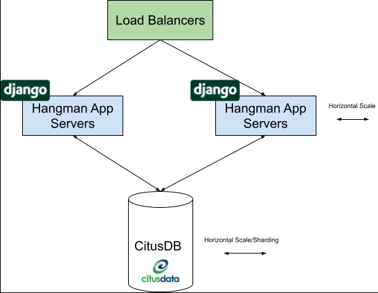
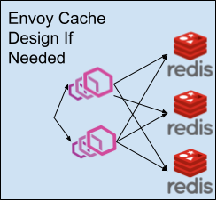

# Hangman

* [About](#About)
* [Setup](#Setup)
* [Running Server](#Running-Server-+-Tests)  
* [API Definitions](#API-Definitions)
* [Schema Design](#Schema-Design)
* [Considerations to Design](#Considerations-to-Design)

# About
This project is a small Hangman game API that is built on the Django framework. Using this API a user can create a game of hangman. Each game chooses a random word out of 100 predefined words found in words.txt.

# Setup
This project is based on Python 3.8. You can grab a copy here https://www.python.org/downloads/release/python-389/

A virtual environment is recommended to be setup:

    python3.8 -m venv /path/to/new/virtual/environment
    source /path/to/new/virtual/environment/bin/activate

Installing requirements:

    pip install -r requirements.txt

# Running Server + Tests

Before running the server migrations must be run:

    ./manage.py migrate

Running Server can be done through the manage.py command. The server will be available locahost:8000:

    ./manage.py runserver

Running Server can be done through the manage.py command. The server will be available locahost:8000:

    ./manage.py tests

# API Definitions
### API's
  - [GET /create_game/](#get-create_game)
  - [GET /get_game/[id]/](#get-get_game)
  - [POST /update_game/[id]/](#post-update_game)
### GET /create_game/
This API will create a game and return the associated ID to access/modify game state.
##### Example: curl -X POST http://localhost:8000/create_game/

Sample Response:

    {
        "id": 1
    }

    Status code: 201

### GET /get_game/[id]/
Using the id from the create game API, this API is used to return the current state of the game.
##### Example: curl -X GET http://localhost:8000/get_game/1/

Sample Response:

    {
        "id": 1, 
        "correct_guesses": "______", 
        "incorrect_guesses": "", 
        "game_status": "IN_PROGRESS"
    }
    Status code: 200

    Error code: 404
    game_not_found - sent back when the game id cannot be found

The id field corresponds to the id that was created with the create_game endpoint. The correct_guesses field holds the empty blanks and correct guesses. The incorrect_guesses will hold a series of guesses the user made that were incorrect. The game_status field hold WIN, LOSS or IN_PROGRESS game states.

### POST /update_game/[id]/
This API accepts a guess payload that supports a-z A-Z letters. This API will only accept one character and will invalidate anything outside of the boundires.
##### Example: curl -d '{"guess": "m"}' -H "Content-Type: application/json" -X POST http://localhost:8000/update_game/1/

Sample Response:

    {
        "id": 124, 
        "correct_guesses": "m___", 
        "incorrect_guesses": "iwe", 
        "game_status": "IN_PROGRESS"
    }
    Status code: 200

    Error code: 400
    invalid_field - example {"guess":["Only a-z and A-Z characters are allowed."]}
    game_finished - when modfying the game and the state is either LOSS or WIN

    Error code: 404
    game_not_found - sent back when the game id cannot be found

When posting a guess to the API the reflected game state will be returned as well. 
Guesses left can be calculated by taking 8 - size(incorrect_guesses).

#Schema Design
The schema design for this project was created to be simple based on the product requirements.

Schema:

    class GameStatus(models.TextChoices):
        IN_PROGRESS = 'IN_PROGRESS'
        WIN = 'WIN'
        LOSS = 'LOSS'

    class HangManGame(models.Model):
        id = models.AutoField(primary_key=True)
        secret_word = models.CharField(max_length=255) 
        correct_guesses = models.CharField(max_length=255)
        incorrect_guesses = models.CharField(max_length=8, default="") 
        game_status = models.CharField(max_length=11, choices=GameStatus.choices, default=GameStatus.IN_PROGRESS) 

These are the definitions for the model:
    
    id = The id and primary key use for indexing. It is the game identifier.
    secret_word = This is the word that the player is trying to guess. It is never returned in the API.
    correct_guesses: This field is the size of the secret_word and holds the correct positions for guesses. Any unguessed fields are on default _. 
    incorrect_guesses: This field holds up to 8 wrong characters representing the gueses.
    game_status: This field holds the status of the game. WIN, LOSS or IN_PROGRESS are set to reflect the sate. Games can not be mondified after status is either LOSS / WIN.

# Considerations to Design
### Overall Design

For this project Django + Django Rest Framework was chosen because it has a great set of tools available for developers. Django Rest Framework has a lot of great tools for everything from ORM, OAuth and API Views. 
It is also highly supported and used by a lot of companies with great success.
It is my recommendation that this is deployed via docker container on kubernetes or nomad. Django should run behind gunicorn with the correct number of workers calculated based on host placement. 
All secrets such passwords in the configs files should be extracted and pathed into environment variables.
My preference is that the API is pure and standalone without any static content served (exception is swagger). Any static content should either be in a separate repo or served behind something like nginx. 
Once deployed it should be easy to add/remove containers horizontally using the configs above. Proper health end points should be built into the application so health can be monitored. 

### Secruity
There is no security on the main API. Anyone can create and edit the games as they are being played. 
To solve this, the Django user framework can be leveraged to lock down the API. 
From there rate limiting should be considered as well, someone could write a script to keep polling infinitely per hour. 
There is also a reminder that the django secret token is exposed in clear text with in the config file.

### Database 
Currently, in its state this application is not production ready. The database used is SQL lite which comes as a standard db with Django. 
There are many great databases such as Postgres that could stand up to the challenge for heavy loads. 
In previous projects I had the chance to use CitusDB which is a distributed Postgres database which also happens to be open source. 
A three node cluster was used that had over 15 billion rows distributed. Average query aggregation time was under 600ms. 
Citus has support natively for sharding tables out to new nodes when load becomes too much to handle. Its scale out architecture works flawlessly and is easy to use and understand.
It also comes with native Django support and integrates well with the ORM. The Enterprise edition also comes with High Availability built into the product.
From my standpoint this is a good free database to start with, it supports the ability to scale out from one node and once things really get going then Citus Enterprise can be considered.
https://www.citusdata.com/product/community

### Potential Caching

Caching is not necessary but should always be planned for. In the event that a cache is needed, I would recommend the use of Envoy backed by Redis servers.
I have had a lot of experiences for caching user data, queries and small data sets with a lot of success.

### Alerts + Metrics
In past projects I have used Prometheus for metrics and alerts. Metrics should be collected for API and the database (p0 p50 p90 p99). 
With metrics diagnosing problems becomes easier to track and understand. Alerts should be set up in case servers go down or certain thresholds are reached that may not be acceptable. Example:
API avg time, CPU usage and Memory usage.

### Schema
Schema was designed to be simple and easy to work with however limiting in some aspects. As more features are added the schema will most likely evolve. 
In the future it might be better to have multiple tables such as having a Game Table that has children that represent guesses. 
This way complicated metrics queries can be done such as "How many guesses on average does it take to guess words with length greater than 6?".
It would probably also make sense to add create dates and update dates to keep track of modifications as games happen. This way historical look ups can be done as well.

### Word Generation
The words generated for the game currently comes from a text file. Each request reads from the file and selects a random word. This will not scale out in production and words should be stored in database for selection.
There may also be requirements in the future for selection of non-repeating words because the current implementation has a chance to repeat the same word for games. One thing to note is that this was developed under the assumption that it would be done for the English Language.
There may be a requirement that it will eventually support other languages, and the generation of words will likely change. When creating the game these options should be passed in POST request.
